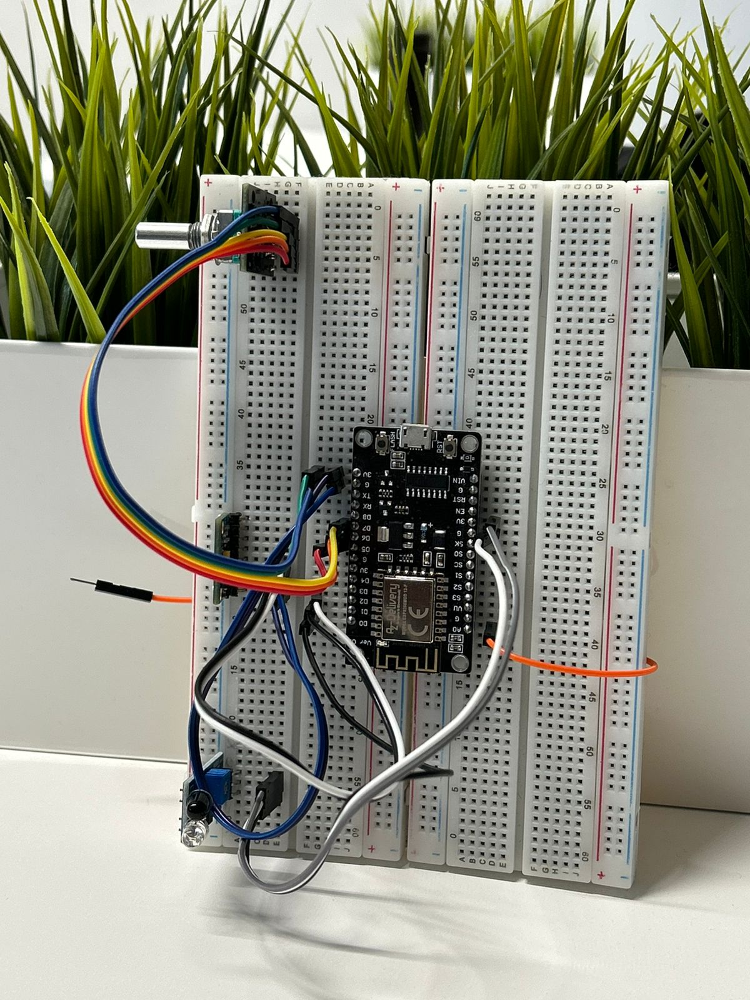

# Sensor Integration in an open-world robot environment

This project provides tools and scripts to integrate real-world sensor data into Unity applications. It facilitates real-time communication between Unity and external sensors using MQTT.
---

  

---
## Functionality:
- Low-latency communication between ESP8266 & Unity over MQTT. 
- MPU6050 for camera panning & motion.
- Pushbutton switch encoder for jumping & changing speed.
- IR sensor for opening/ closing doors.
- DHT11 for temperature monitoring.

## Standout features:
- MQTT enables a modular architecture by allowing sensors to push data automatically, eliminating the need for continuous polling from the client.
- `Sensor_Values.cs` stores incoming sensor values in variable making it accessible to other scripts while also focusing on thread-safe execution.  
- Kalman Filter processing on ESP8266 combines noisy accelerometer data & drifting gyroscope data to accurately estimate orientation (roll & pitch) using a prediction-update cycle.
- On-board flash button of ESP8266 is repurposed to toggle between movement & camera panning due to availability of only one MPU6050.
- Take resultant of roll and pitch values to define magnitude and direction of movement.
- Defined dead zones in movement to mitigate the effects of jittery readings at neutral position of MPU6050.
- Debounce logic for IR Sensors prevents rapid toggling & ensures stable door operation when IR sensor detects presence.
- "Party Mode" is activated using the A0 pin for touch detection. To minimize interference from static, a running average filter is applied to smooth the readings.
---
## Setup:
### Circuit:

  

  
- **Flash button pin** <-> GPIO 0 (D3)
- **IR Sensor Pin** <-> GPIO 16 (D0)
- **Touch Pin** <-> A0
- **Encoder CLK Pin** <-> GPIO 14 (D5)
- **Encoder DT Pin** <-> GPIO 12 (D6)
- **Encoder Button Pin** <-> GPIO 13 (D7)

- **MPU6050 SDA Pin** <-> GPIO 4 (D2)
- **MPU6050 SCL Pin** <-> GPIO 5 (D1)
- **MPU6050 Power** <-> 3.3V
- **MPU6050 Ground** <-> GND

### MQTT Server:
- Before starting the mosquitto broker (Eclipse Mosquitto in our case), update the mosquitto.conf file by adding the following lines:
allow_anonymous true
listener 1883 (server_IP)
Mosquitto broker can then be started through CLI, navigating to location of `mosquitto.conf` and typing:
mosquitto -v -c mosquitto.conf
